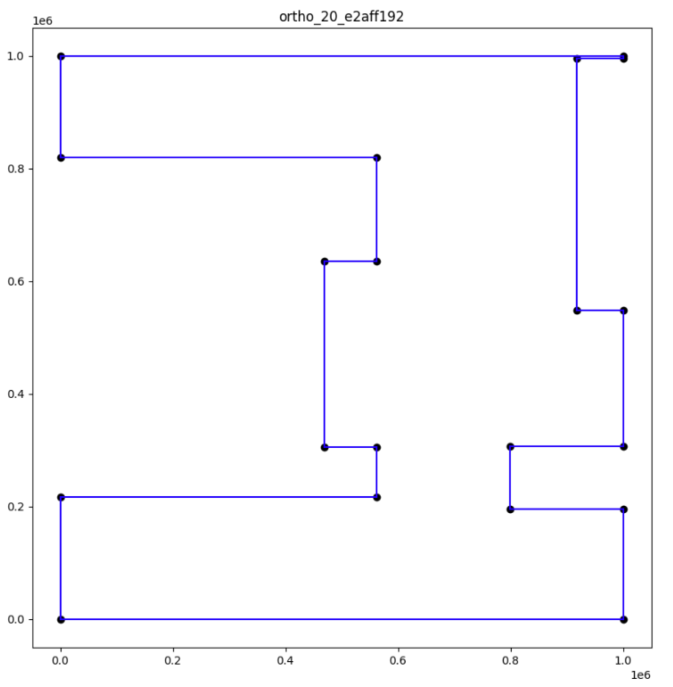
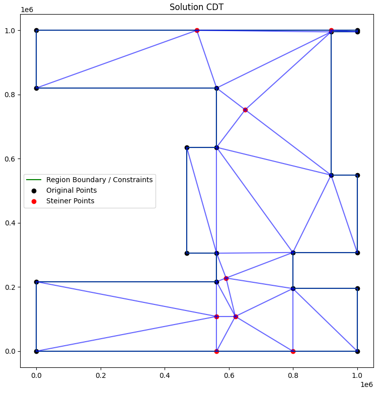

## Goal 

The goal of this project is to find non-obtuse triangulations for a [PSLG Graph](https://en.wikipedia.org/wiki/Planar_straight-line_graph) or
minimize the number of obtuse angles if we are not able to eliminate them.<br>
This was a Uni project based on the [CG:SHOP 2025](https://cgshop.ibr.cs.tu-bs.de/) competition.

## Implementation
We begin with a Delaunay triangulation and refine it by adding steiner points to the cdt.<br>
The specific placement of steiner points is determined using optimization algorithms, including Simulated Annealing, Ant Colony Optimization and Local Search<br>
We use [CGAL](https://www.cgal.org/) library.

## Example 

**input**<br>

**solution**<br>


## Build and run 
```
mkdir build
cd build
cmake ..
make
./opt_triangulation -i ../input.json -o ../output.json [-preselected_params]
```
- **dependencies:** Cgal, Boost, Qt, cmake


## Contributors 
[IliasMr](https://github.com/IliasMr)<br>
[xKostmand](https://github.com/xKostmand)

